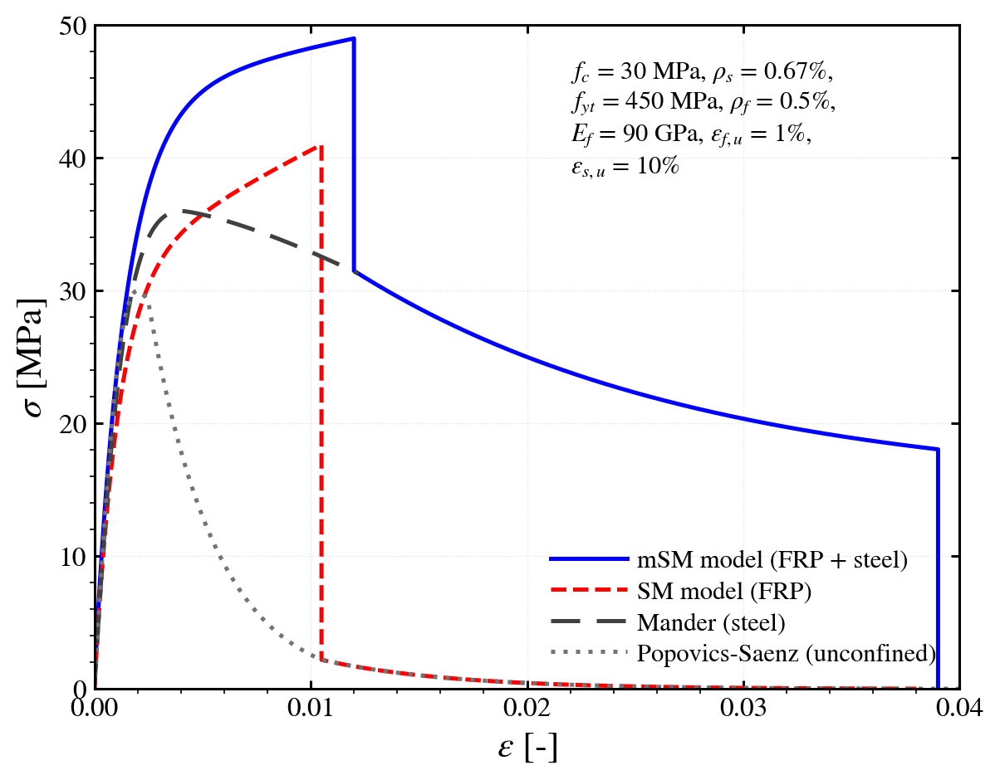
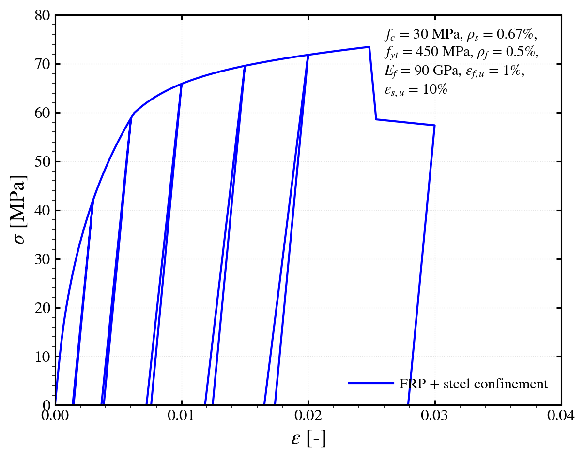
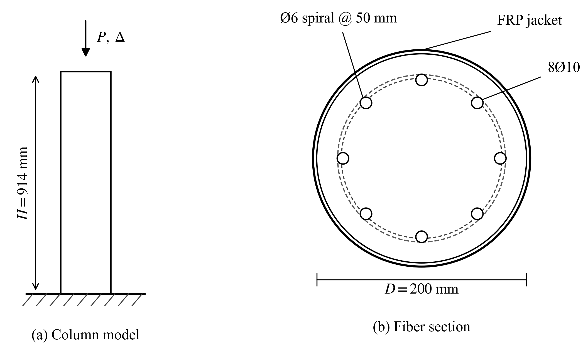
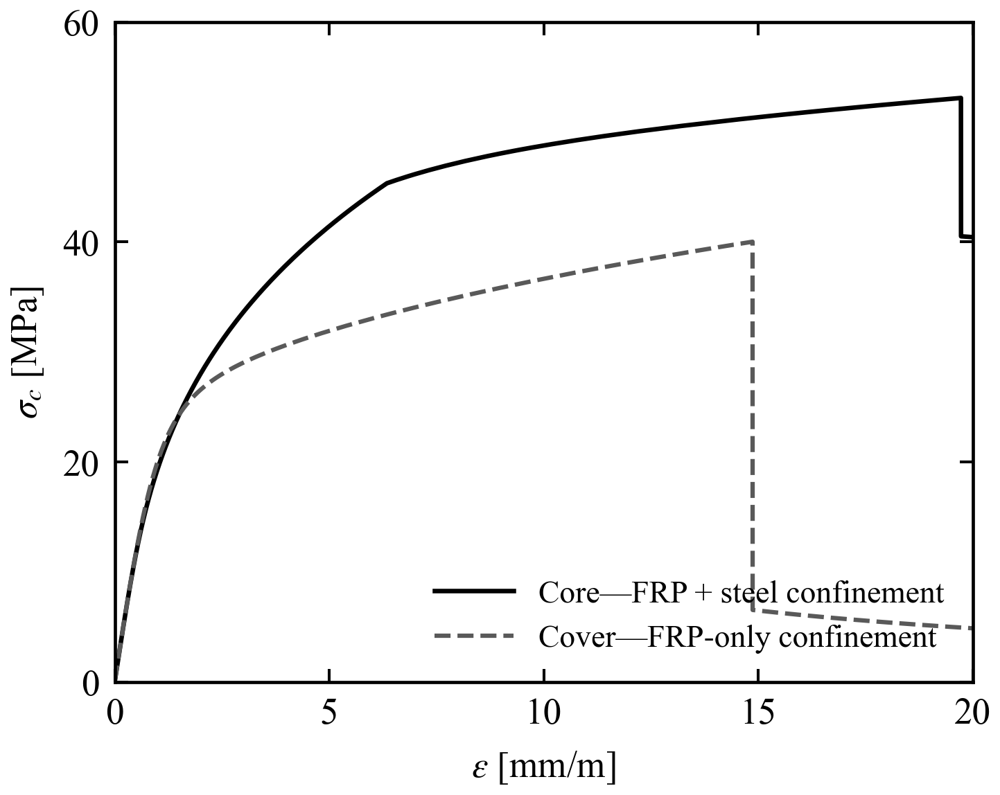
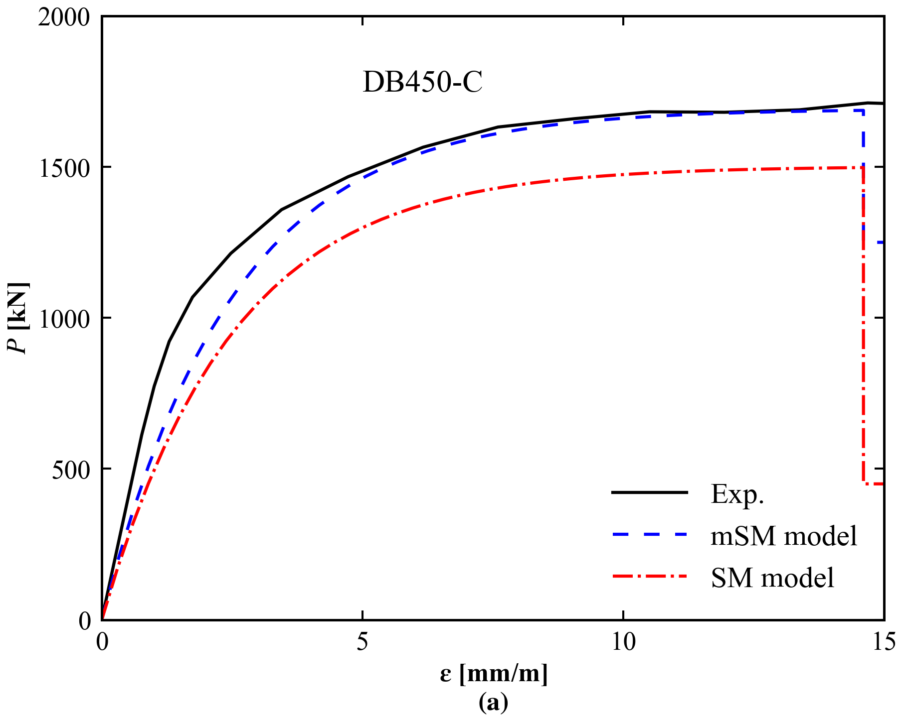

.. _ConcreteZBH:

ConcreteZBH - FRP- and Steel-Confined Concrete Material
=======================================================

This command constructs a uniaxial confined concrete material that accounts for the simultaneous confining effects of transverse steel reinforcement and external FRP jackets. The model incorporates cyclic hysteretic unloading and reloading rules, confinement pressure calculations, a nonlinear compression envelope, and tension cut-off behavior. This material is experimental; validate against your own benchmark before production use. 

Material Variants
-----------------

Three implementations are available: **ConcreteZBH_smoothed**, **ConcreteZBH_original**, and **ConcreteZBH_fitted**.

ConcreteZBH_smoothed
^^^^^^^^^^^^^^^^^^^^

The smoothed variant uses iterative confinement pressure calculation with smooth transitions for improved numerical stability.

.. code-block:: tcl

   uniaxialMaterial ConcreteZBH_smoothed $matTag $fc0 $ec0 $Ec $Es $fy $eults $s $As_t $Ef $eultf $tf $D $Ds $As_l $kg_f $ks_s $ks_f $type_reinf

ConcreteZBH_original
^^^^^^^^^^^^^^^^^^^^

The original variant uses direct confinement pressure calculation with standard envelope formulation.

.. code-block:: tcl

   uniaxialMaterial ConcreteZBH_original $matTag $fc0 $ec0 $Ec $Es $fy $eults $s $As_t $Ef $eultf $tf $D $Ds $As_l $kg_f $ks_s $ks_f $type_reinf

ConcreteZBH_fitted
^^^^^^^^^^^^^^^^^^

The fitted variant uses polynomial coefficients to define the compression envelope, providing flexibility for fitting experimental data.

.. code-block:: tcl

   uniaxialMaterial ConcreteZBH_fitted $matTag $fc0 $ec0 $Ec $fccs $eccs $rs $e1 $e2 $e3 $e4 $e5 $e6 $e7 $e8 $e9 $eps_cy $eps_ccuf $sig_ccuf $eps_ccus $sig_ccus

Parameters
----------

.. csv-table::
   :header: "Parameter", "Type", "Description", "Smoothed", "Original", "Fitted", "Units"
   :widths: 12, 10, 42, 9, 9, 9, 9

   "$matTag", |integer|, "Material tag", "✓", "✓", "✓", "[-]"
   "$fc0", |float|, "Unconfined concrete compressive strength (specify as negative)", "✓", "✓", "✓", "[F/L²]"
   "$ec0", |float|, "Strain at peak unconfined compressive strength", "✓", "✓", "✓", "[-]"
   "$Ec", |float|, "Elastic modulus of concrete", "✓", "✓", "✓", "[F/L²]"
   "$Es", |float|, "Elastic modulus of transverse steel", "✓", "✓", "", "[F/L²]"
   "$fy", |float|, "Yield strength of transverse steel (set to 0.0 with $As_t = 0.0 for FRP-only confinement)", "✓", "✓", "", "[F/L²]"
   "$eults", |float|, "Ultimate fracture strain of transverse steel", "✓", "✓", "", "[-]"
   "$s", |float|, "Center-to-center pitch/spacing of transverse hoops or spirals", "✓", "✓", "", "[L]"
   "$As_t", |float|, "Cross-sectional area of a single transverse bar (set to 0.0 with $fy = 0.0 for FRP-only confinement)", "✓", "✓", "", "[L²]"
   "$Ef", |float|, "Elastic tensile modulus of FRP jacket (set to 0.0 for steel-only confinement)", "✓", "✓", "", "[F/L²]"
   "$eultf", |float|, "Effective ultimate hoop rupture strain of FRP jacket", "✓", "✓", "", "[-]"
   "$tf", |float|, "Total design thickness of FRP jacket (set to 0.0 for steel-only confinement)", "✓", "✓", "", "[L]"
   "$D", |float|, "Gross diameter of circular cross-section", "✓", "✓", "", "[L]"
   "$Ds", |float|, "Core diameter measured to centerline of transverse steel", "✓", "✓", "", "[L]"
   "$As_l", |float|, "Total longitudinal reinforcement area (arching factor only; does not contribute axial capacity)", "✓", "✓", "", "[L²]"
   "$kg_f", |float|, "FRP jacket geometric effectiveness coefficient (1.0 for circular sections)", "✓", "✓", "", "[-]"
   "$ks_s", |float|, "Transverse steel confinement effectiveness multiplier (1.0 for circular spirals)", "✓", "✓", "", "[-]"
   "$ks_f", |float|, "FRP composite confinement effectiveness multiplier", "✓", "✓", "", "[-]"
   "$type_reinf", |float|, "Transverse configuration flag (1.0 = circular spiral/hoop; only accepted value)", "✓", "✓", "", "[-]"
   "$fccs", |float|, "Steel-confined concrete compressive strength (reference peak state for fitted normalization)", "", "", "✓", "[F/L²]"
   "$eccs", |float|, "Strain at peak steel-confined strength (reference peak state for fitted normalization)", "", "", "✓", "[-]"
   "$rs", |float|, "Shape parameter for Popovics post-peak envelope curve", "", "", "✓", "[-]"
   "$e1 to $e9", |float|, "Polynomial coefficients for Regions 1 and 2. $e1 is 4th-order, $e2 is 3rd-order, $e3 is 2nd-order, $e4 is 1st-order (satisfies $e4 = Ec·\|eccs\|/\|fccs\|), $e5 to $e9 are post-transition coefficients.", "", "", "✓", "[-]"
   "$eps_cy", |float|, "Transition strain between polynomial regions (normalized by eccs)", "", "", "✓", "[-]"
   "$eps_ccuf", |float|, "Compressive concrete strain at FRP jacket rupture", "", "", "✓", "[-]"
   "$sig_ccuf", |float|, "Compressive concrete stress at FRP jacket rupture", "", "", "✓", "[F/L²]"
   "$eps_ccus", |float|, "Ultimate compressive strain at transverse steel rupture", "", "", "✓", "[-]"
   "$sig_ccus", |float|, "Compressive stress at ultimate transverse steel rupture", "", "", "✓", "[F/L²]"

.. note::
   **Important Usage Notes**

   * Concrete compressive strength must be specified as **negative**.
   * Tension stress is automatically set to zero for positive strain.
   * Cyclic unloading and reloading follow Mander confinement pressure rules.
   * Crack opening and closing are detected automatically during unloading.
   * For confined concretes, confinement pressure is solved iteratively (max 20 iterations).
   * All three variants produce identical results for configurations with no FRP.
   * **Smoothed variant:** Better numerical stability; recommended for most analyses.
   * **Original variant:** Direct formulation; useful for validation against literature.
   * **Fitted variant:** Maximum flexibility for custom stress-strain curves from experiments.

Behavior
--------

   Monotonic compressive stress-strain envelope behavior of FRP- and steel-confined concrete.

   Cyclic stress-strain response demonstrating hysteretic unloading and reloading loops.

Code Examples
-------------

Example 1: ConcreteZBH_smoothed Material Definition
^^^^^^^^^^^^^^^^^^^^^^^^^^^^^^^^^^^^^^^^^^^^^^^^^^^

Smoothed variant with both steel and FRP confinement.

.. code-block:: tcl

   # =========================================================================
   # OpenSees Example 1: ConcreteZBH_smoothed Material Definition
   # Units: N, mm, MPa
   # =========================================================================
   
   # Unconfined concrete properties
   set fc0   -53.61
   set ec0   -0.00246967424
   set Ec     36609.425
   
   # Transverse steel spiral
   set Es     200000.0
   set fy      437.0
   set eults   0.10
   set s        60.0
   set As_t     78.54
   
   # FRP jacket
   set Ef      45000.0
   set eultf    0.015
   set tf        1.58
   
   # Section geometry
   set D       205.0
   set Ds      155.0
   set As_l    678.6
   
   # Effectiveness coefficients (circular section)
   set kg_f          1.0
   set ks_s          1.0
   set ks_f          1.0
   set type_reinf    1.0
   
   uniaxialMaterial ConcreteZBH_smoothed 1 $fc0 $ec0 $Ec $Es $fy $eults $s $As_t $Ef $eultf $tf $D $Ds $As_l $kg_f $ks_s $ks_f $type_reinf

Example 2: ConcreteZBH_original Material Definition
^^^^^^^^^^^^^^^^^^^^^^^^^^^^^^^^^^^^^^^^^^^^^^^^^^^

Original variant with direct confi nement pressure calculation.

.. code-block:: tcl

   # =========================================================================
   # OpenSees Example 2: ConcreteZBH_original Material Definition
   # Units: N, mm, MPa
   # =========================================================================
   
   # Unconfined concrete properties
   set fc0   -53.61
   set ec0   -0.00246967424
   set Ec     36609.425
   
   # Transverse steel spiral
   set Es     200000.0
   set fy      437.0
   set eults   0.10
   set s        60.0
   set As_t     78.54
   
   # FRP jacket
   set Ef      45000.0
   set eultf    0.015
   set tf        1.58
   
   # Section geometry
   set D       205.0
   set Ds      155.0
   set As_l    678.6
   
   # Effectiveness coefficients (circular section)
   set kg_f          1.0
   set ks_s          1.0
   set ks_f          1.0
   set type_reinf    1.0
   
   uniaxialMaterial ConcreteZBH_original 2 $fc0 $ec0 $Ec $Es $fy $eults $s $As_t $Ef $eultf $tf $D $Ds $As_l $kg_f $ks_s $ks_f $type_reinf

Example 3: ConcreteZBH_fitted Material Definition
^^^^^^^^^^^^^^^^^^^^^^^^^^^^^^^^^^^^^^^^^^^^^^^^^

Fitted variant with polynomial envelope from experimental data.

.. code-block:: tcl

   # =========================================================================
   # OpenSees Example 3: ConcreteZBH_fitted Material Definition
   # Units: N, mm, MPa
   # =========================================================================
   
   # Base unconfined concrete properties
   set fc0   -53.61
   set ec0   -0.00246967424
   set Ec     36609.425
   
   # Steel-confined reference peak
   set fccs  -78.5
   set eccs   -0.0035
   set rs        2.5
   
   # Polynomial coefficients (e4 satisfies initial tangent constraint: Ec*\|eccs\|/\|fccs\| = 1.632)
   set e1   0.35
   set e2  -0.15
   set e3   0.08
   set e4   1.632
   set e5   0.25
   set e6  -0.10
   set e7   0.05
   set e8   0.06
   set e9   0.01
   
   # Transitions and failure limits (compressive strains and stresses negative)
   set eps_cy    -0.004
   set eps_ccuf  -0.005
   set sig_ccuf   -65.0
   set eps_ccus  -0.008
   set sig_ccus   -72.0
   
   uniaxialMaterial ConcreteZBH_fitted 3 $fc0 $ec0 $Ec $fccs $eccs $rs $e1 $e2 $e3 $e4 $e5 $e6 $e7 $e8 $e9 $eps_cy $eps_ccuf $sig_ccuf $eps_ccus $sig_ccus

Example 4: Full-Scale Column Simulation (Specimen DB450-C)
^^^^^^^^^^^^^^^^^^^^^^^^^^^^^^^^^^^^^^^^^^^^^^^^^^^^^^^^^^

Simulation of a Circular RC Column Confined with Steel and FRP.

.. code-block:: tcl

   # =========================================================================
   # Simulation of Circular RC Column DB450-C Confined with Steel and FRP
   # Specimen DB450-C (Parretti and Nanni 2002; Zignago et al. 2018)
   # =========================================================================
   wipe
   model BasicBuilder -ndm 2 -ndf 3
   
   # Select confinement case:
   #   "mSM" = Simultaneous Steel + FRP confinement on core concrete
   #   "SM"  = FRP-only concrete (steel modeled explicitly in section)
   set confinementCase "mSM"
   
   # Column geometry
   set D 200.0;                       # Gross circular column diameter (mm)
   set H 914.0;                       # Column height (mm)
   set cover 20.0;                    # Clear cover to outer face of transverse spiral (mm)
   set dSpiral 6.0;                   # Spiral bar diameter (mm)
   set spiralPitch 50.0;              # Pitch of spiral (mm)
   set nBars 8;                       # Number of longitudinal bars
   set dBar 10.0;                     # Longitudinal bar diameter (mm)
   
   # Core diameter measured to centerline of spiral:
   set Dcore [expr $D - 2.0*$cover - $dSpiral];  # = 200 - 40 - 6 = 154.0 mm
   set R     [expr $D / 2.0];                    # 100.0 mm
   set Rcore [expr $Dcore / 2.0];                # 77.0 mm
   
   # Longitudinal bar centroid radius (placed immediately inside the spiral):
   set Rbar  [expr $Rcore - $dSpiral/2.0 - $dBar/2.0]; # = 77.0 - 3.0 - 5.0 = 69.0 mm
   
   # Concrete properties
   set fc0   -25.5                    ;# Unconfined concrete compressive strength (MPa)
   set epsc0 -0.0020                  ;# Strain at peak unconfined strength
   set Ec    [expr 5000.0*sqrt(abs($fc0))]
   
   # Longitudinal steel reinforcement (8 #10 bars, fy = 393 MPa)
   set fyLong 393.0
   set EsLong 200000.0
   set bLong  0.005                   ;# Monotonic Steel02 hardening ratio
   set pi     [expr acos(-1.0)]
   set AsBar  [expr $pi*$dBar*$dBar/4.0]
   set AsLong [expr $nBars*$AsBar]
   
   # Transverse steel reinforcement (spiral)
   set fySpiral 517.0
   set EsSpiral 200000.0
   set epsSu    0.10
   set AsSpiral [expr $pi*$dSpiral*$dSpiral/4.0]
   
   # FRP jacket properties
   set tFRP 0.270
   set EFRP 125600.0
   set epsFRPcoupon 0.019
   set xiFRP 0.45
   set epsFRPeffective [expr $xiFRP*$epsFRPcoupon]
   
   # Material tags
   set matCore  1
   set matCover 2
   set matSteel 3
   
   if {$confinementCase eq "mSM"} {
       set coreSpiralFy $fySpiral
       set coreAsLong   $AsLong
   } else {
       # SM case: FRP-only concrete; longitudinal bars remain explicit
       set coreSpiralFy 0.0
       set coreAsLong   0.0
   }
   
   # Uniaxial materials: ConcreteZBH for core and cover concrete
   # Core: Combined transverse steel and FRP jacket confinement
   uniaxialMaterial ConcreteZBH_original $matCore  $fc0 $epsc0 $Ec $EsSpiral $coreSpiralFy $epsSu $spiralPitch $AsSpiral $EFRP $epsFRPeffective $tFRP $D $Dcore $coreAsLong 1.0 1.0 1.0 1.0
   
   # Cover: Transverse steel deactivated (fy = 0.0, As_t = 0.0, As_l = 0.0) -> FRP jacket confinement only
   uniaxialMaterial ConcreteZBH_original $matCover $fc0 $epsc0 $Ec $EsSpiral 0.0          $epsSu $spiralPitch 0.0       $EFRP $epsFRPeffective $tFRP $D $Dcore 0.0         1.0 1.0 1.0 1.0
   
   # Explicit longitudinal steel rebar material
   uniaxialMaterial Steel02 $matSteel $fyLong $EsLong $bLong 20.0 0.925 0.15
   
   # Section discretization (Fiber section)
   section Fiber 1 {
       patch circ $matCore  20 16  0.0 0.0  0.0    $Rcore  0.0 360.0
       patch circ $matCover 20  4  0.0 0.0  $Rcore $R      0.0 360.0
       layer circ $matSteel $nBars $AsBar 0.0 0.0  $Rbar   0.0 315.0
   }
   
   # Nodes and boundary conditions
   node 1 0.0 0.0
   node 2 0.0 $H
   fix 1 1 1 1
   fix 2 1 0 1
   
   # Coordinate transformation and beam integration definition
   geomTransf Linear 1
   beamIntegration Lobatto 1 1 5;     # integrationTag=1, secTag=1, numIntPoints=5
   element forceBeamColumn 1 1 2 1 1; # eleTag=1, iNode=1, jNode=2, transfTag=1, integrationTag=1
   
   # Recorders (note: "section 3" refers to Gauss-Lobatto integration point 3, mid-height of element)
   recorder Node -file displacement.out -node 2 -dof 2 disp
   recorder Node -file reaction.out -node 1 -dof 2 reaction
   recorder Element -file core_fiber.out -ele 1 section 3 fiber 0.0 0.0 $matCore stressStrain
   recorder Element -file cover_fiber.out -ele 1 section 3 fiber 0.0 [expr 0.5*($Rcore+$R)] $matCover stressStrain
   
   # Loading and analysis definition
   timeSeries Linear 1
   pattern Plain 1 1 { load 2 0.0 -1.0 0.0 }
   
   constraints Plain
   numberer Plain
   system BandGeneral
   test NormDispIncr 1.0e-8 50 0
   algorithm Newton
   set dU -0.002
   integrator DisplacementControl 2 2 $dU
   analysis Static
   
   # Displacement-controlled execution (target 2.0% axial strain)
   set targetDisp [expr -0.020 * $H]
   set ok 0
   set steps 0
   set maxAxialLoad 0.0
   
   while {[nodeDisp 2 2] > $targetDisp && $ok == 0} {
       set ok [analyze 1]
       if {$ok == 0} {
           incr steps
           reactions
           set currentP [expr abs([nodeReaction 1 2])]
           if {$currentP > $maxAxialLoad} {
               set maxAxialLoad $currentP
           }
       }
   }
   
   puts [format "DB450-C (%s): return=%d accepted_steps=%d final_disp=%.4f mm peak_axial_load=%.1f kN" $confinementCase $ok $steps [nodeDisp 2 2] [expr $maxAxialLoad/1000.0]]
   wipe

Execution Output from OpenSees:

.. code-block:: text

   DB450-C (mSM): return=0 accepted_steps=9140 final_disp=-18.2800 mm peak_axial_load=1728.7 kN

   Description of the structural model and fiber-discretized section.

   Stress-strain response of the core and cover concrete fibers.

   Global axial force-displacement response of the column.

Credits & Contact
-----------------

| Shingini Lahiri (Department of Civil Engineering, Indian Institute of Technology Madras)
| Prakash Singh Badal (Department of Civil Engineering, Indian Institute of Technology Madras)
| Michele Barbato (Department of Civil & Environmental Engineering, University of California, Davis) `mbarbato@ucdavis.edu <mailto:mbarbato@ucdavis.edu>`_

References
----------

* Parretti, R., and Nanni, A. (2002). "Axial Testing of RC Columns Confined with FRP." *Center for Infrastructure Engineering Studies (CIES) Report 02-33*, University of Missouri-Rolla, Rolla, MO.

* Zignago, D., Barbato, M., and Hu, D. (2018). "Constitutive Model of Concrete Simultaneously Confined by FRP and Steel for Finite-Element Analysis of FRP-Confined RC Columns." *Journal of Structural Engineering*, 144(10), 04018178. `https://doi.org/10.1061/(ASCE)ST.1943-541X.0002166 <https://doi.org/10.1061/(ASCE)ST.1943-541X.0002166>`_

* Zignago, D., and Barbato, M. (2023). "New Analytical Analysis-Oriented Stress-Strain Model for FRP-and-Steel Confined Concrete." *Journal of Structural Engineering*, 149(1), 04022212. `https://doi.org/10.1061/JSENDH.STENG-11634 <https://doi.org/10.1061/JSENDH.STENG-11634>`_
